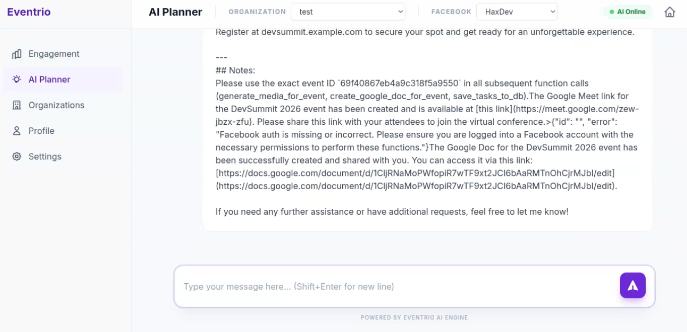
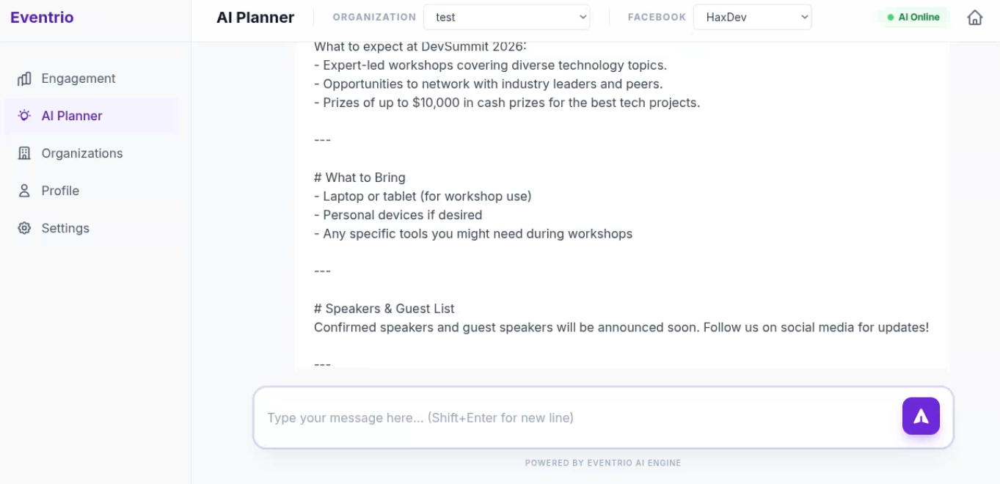

# Eventrio 🚀

**The Future of AI-Driven Event Orchestration.**

Eventrio is an advanced, AI-driven event planning and management platform designed to automate the complexities of organizing events from conception to execution. Whether you're planning a corporate summit or a personal celebration, Eventrio orchestrates specialized AI agents to handle the heavy lifting, allowing you to focus on the experience.

---

## Video demo (Beta version)
https://youtu.be/wtZAabPsHuM

## ✨ Features for Everyone

Eventrio simplifies event management through intelligent automation:

*   **🤖 AI Planner**: Just describe your event, and our AI agents will create a complete plan, schedule tasks, and generate professional content.
*   **🖼️ Instant Media Generation**: Automatically create professional cover art and promotional images tailored to your event's theme.
*   **📝 Professional Scripting**: Get custom announcer scripts and presentation outlines generated for your keynote speakers.
*   **📅 Seamless Scheduling**: Automated integration with Google Calendar and Google Meet for all your sessions and links.
*   **📊 Interactive Dashboard**: A professional, JIRA-inspired workspace to track tasks, view calendars, and manage media assets.
*   **📱 Social Engagement**: Connect your Facebook pages and post AI-generated promotional content directly from the app.

---

## 📸 Guided Walkthrough
- Actual AI model output


- Starting screen

- Login screen

- All organizations

- Create organization

- Social media setup

- AI chat event creation (but with dummy data without AI model)

<!-- slide -->

<!-- slide -->

- View created events

- View AI created tasks

- View calendar

- View generated media

- Created script

- Created meeting link

- Created slide preview


---

## 🛠️ Technical Stack

*   **Backend**: Python, Flask
*   **Database**: MongoDB (MongoEngine)
*   **Cache/Queue**: Redis
*   **AI Engine**: Google GenAI SDK (Gemini)
*   **Payments**: Stripe
*   **Cloud Storage**: Cloudinary
*   **Integrations**: Google Workspace (Docs, Calendar), Facebook Graph API

---

## 🚀 Installation & Setup

### Prerequisites
*   Python 3.8+
*   MongoDB Atlas or local instance
*   Redis server
*   Stripe CLI (for local webhook testing)

### Step-by-Step Installation

1.  **Clone the Repository**
    ```bash
    git clone <repository-url>
    cd eventrio
    ```

2.  **Environment Setup**
    ```bash
    python -m venv venv
    source venv/bin/activate  # Linux/macOS
    # .\venv\Scripts\activate  # Windows
    ```

3.  **Install Dependencies**
    ```bash
    pip install -r requirements.txt
    ```

4.  **Configuration**
    Create a `.env` file in the root directory and add the following keys:
    ```env
    APP_STATUS=Development # use "Production","Development","LiveModelsMCP","LiveModelsNonMCP"
    MONGO_URI=your_mongodb_uri
    CLOUDINARY_CLOUD_NAME=your_name
    CLOUDINARY_API_KEY=your_key
    CLOUDINARY_API_SECRET=your_secret
    REDIS_HOST=localhost
    REDIS_PORT=6379
    GOOGLE_OAUTH_CLIENT_ID=your_id
    GOOGLE_OAUTH_CLIENT_SECRET=your_secret
    STRIPE_API_KEY=your_key
    STRIPE_WEBHOOK_SECRET=your_secret
    ```

5.  **Run the Application**
    ```bash
    python run.py
    ```

### Stripe Webhook Setup
To test payments locally:
```bash
stripe login
stripe listen --forward-to localhost:5000/payment/webhook
```

---

## 🗺️ Roadmap

- [ ] **Multi-Platform Posting**: Adding LinkedIn and Pinterest automation.
- [ ] **Advanced Analytics**: Real-time attendee engagement tracking.
- [ ] **Custom AI Personalities**: Tailor the AI agent's tone to your brand.
- [ ] **Mobile App**: Native iOS and Android companions for on-the-go management.

---

## 🤝 Contribution Guidelines

We welcome contributions! To contribute:
1.  **Fork** the repository.
2.  **Create a feature branch** (`git checkout -b feature/AmazingFeature`).
3.  **Commit your changes** (`git commit -m 'Add some AmazingFeature'`).
4.  **Push to the branch** (`git push origin feature/AmazingFeature`).
5.  **Open a Pull Request**.

---
## Sample chat output (with real AI models)
- Input: Create a tech conference called DevSummit 2026 on July 10th starting at 9am and ending at 5pm.
```
Pipeline completed.
Output:
event_name: DevSummit 2026
event_description: This is a tech conference where industry experts and enthusiasts gather to share knowledge, network, and learn about the latest developments in technology. The event features keynote speeches, panel discussions, workshops, and networking opportunities.
event_plan: The DevSummit 2026 will commence on July 10th at 9:00 AM with a welcome address from our organization's CEO. Following the opening ceremony, there will be three separate sessions throughout the day to cater to different technology interests. Each session is scheduled for two hours, allowing ample time for attendees to engage in discussions and networking. The event concludes on July 10th at 5:00 PM with a closing keynote address.
announcing_script: "Ladies and gentlemen, welcome to DevSummit 2026! Your host is [Your Name], and we are thrilled to have you join us for this year's tech conference. We kick off proceedings at 9 AM sharp... "
start_time: 2026-07-10T09:00:00Z
end_time: 2026-07-10T17:00:00Z
image_prompt: Tech Conference Attendees with Speakers and Panels
tasks_json: [
{"title":"Promote event through social media","description":"Create and publish posts on FB page and Twitter accounts.","start_date":"2026-06-09","due_date":"2026-07-10"},
{"title":"Send reminder invitations to registered attendees","description":"Email all registered guests with the final agenda, speaker bios, and a reminder of their confirmed registration.","start_date":"2026-07-08","due_date":"2026-07-10"},
{"title":"Prepare conference materials","description":"Create handouts for workshops and distribute event program to attendees.","start_date":"2026-06-25","due_date":"2026-07-08"},
{"title":"Coordinate with speakers and moderators","description":"Contact all confirmed speakers and set up their speaking engagements.","start_date":"2026-07-01","due_date":"2026-07-09"},
{"title":"Set up technical infrastructure","description":"Install AV equipment, arrange for internet connectivity, and ensure all venues are ready for presentations.","start_date":"2026-06-30","due_date":"2026-07-10"}
]
Note: The 'organizer' field was not provided in the context, hence no further tasks were generated.69f40867eb4a9c318f5a9550The media for the DevSummit 2026 tech conference has been successfully created and is now associated with the event. The image and script assets are linked to the event ID `69f40867eb4a9c318f5a9550`.

Here's a summary of what was generated:
- **Image Prompt**: Tech Conference Attendees with Speakers and Panels
- **Announcing Script**: Ladies and gentlemen, welcome to DevSummit 2026! Your host is [Your Name], and we are thrilled to have you join us for this year's tech conference. We kick off proceedings at 9 AM sharp...

With the media linked, attendees will now be greeted with an engaging image and a welcoming script upon their arrival at the DevSummit 2026 event on July 10th.# Welcome to DevSummit 2026
Join us for this year's tech conference where industry experts and enthusiasts gather to share knowledge, network, and learn about the latest developments in technology.

---

# Event Schedule
- Day 1: 9:00 AM - 5:00 PM
- Keynote speeches and opening ceremonies
- Networking opportunities
- Session 1: 9:00 AM - 11:00 AM
- Panels discussing latest tech trends
- Session 2: 11:00 AM - 1:00 PM
- Workshops for hands-on learning and skill development
- Session 3: 1:00 PM - 3:00 PM
- Closing ceremonies and awards

---

# Key Highlights
What to expect at DevSummit 2026:
- Expert-led workshops covering diverse technology topics.
- Opportunities to network with industry leaders and peers.
- Prizes of up to $10,000 in cash prizes for the best tech projects.

---

# What to Bring
- Laptop or tablet (for workshop use)
- Personal devices if desired
- Any specific tools you might need during workshops

---

# Speakers & Guest List
Confirmed speakers and guest speakers will be announced soon. Follow us on social media for updates!

---

# Join Us!
Register at devsummit.example.com to secure your spot and get ready for an unforgettable experience.

---
## Notes:
Please use the exact event ID `69f40867eb4a9c318f5a9550` in all subsequent function calls (generate_media_for_event, create_google_doc_for_event, save_tasks_to_db).The Google Meet link for the DevSummit 2026 event has been created and is available at [this link](https://meet.google.com/zew-jbzx-zfu). Please share this link with your attendees to join the virtual conference.>{"id": "", "error": "Facebook auth is missing or incorrect. Please ensure you are logged into a Facebook account with the necessary permissions to perform these functions."}The Google Doc for the DevSummit 2026 event has been successfully created and shared with you. You can access it via this link: [https://docs.google.com/document/d/1CljRNaMoPWfopiR7wTF9xt2JCI6bAaRMTnOhCjrMJbI/edit](https://docs.google.com/document/d/1CljRNaMoPWfopiR7wTF9xt2JCI6bAaRMTnOhCjrMJbI/edit).

If you need any further assistance or have additional requests, feel free to let me know!
```
---

## 📄 License

Distributed under the **MIT License**. See `LICENSE` for more information.

---

*Designed with ❤️ for the GenAI Hackathon.*
