# Eventrio 🚀

**The Future of AI-Driven Event Orchestration.**

Eventrio is an advanced, AI-driven event planning and management platform designed to automate the complexities of organizing events from conception to execution. Whether you're planning a corporate summit or a personal celebration, Eventrio orchestrates specialized AI agents to handle the heavy lifting, allowing you to focus on the experience.

---

## ✨ Features for Everyone

Eventrio simplifies event management through intelligent automation:

*   **🤖 AI Planner**: Just describe your event, and our AI agents will create a complete plan, schedule tasks, and generate professional content.
*   **🖼️ Instant Media Generation**: Automatically create professional cover art and promotional images tailored to your event's theme.
*   **📝 Professional Scripting**: Get custom announcer scripts and presentation outlines generated for your keynote speakers.
*   **📅 Seamless Scheduling**: Automated integration with Google Calendar and Google Meet for all your sessions and links.
*   **📊 Interactive Dashboard**: A professional, JIRA-inspired workspace to track tasks, view calendars, and manage media assets.
*   **📱 Social Engagement**: Connect your Facebook pages and post AI-generated promotional content directly from the app.

---

## 📸 Guided Walkthrough

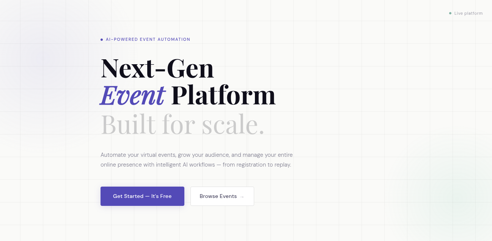
<!-- slide -->
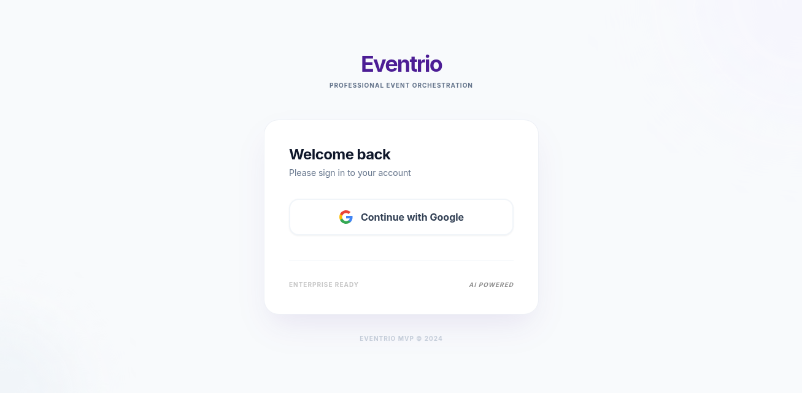
<!-- slide -->
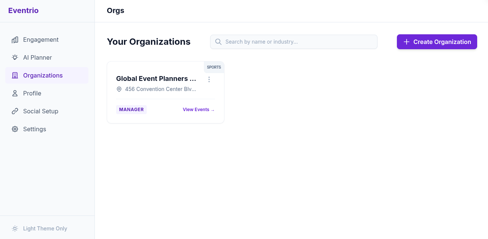
<!-- slide -->
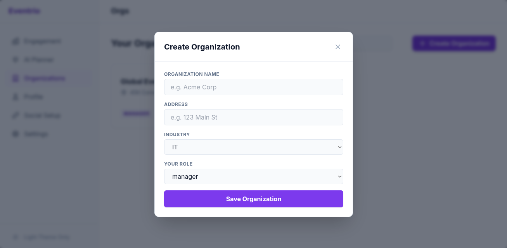
<!-- slide -->

<!-- slide -->
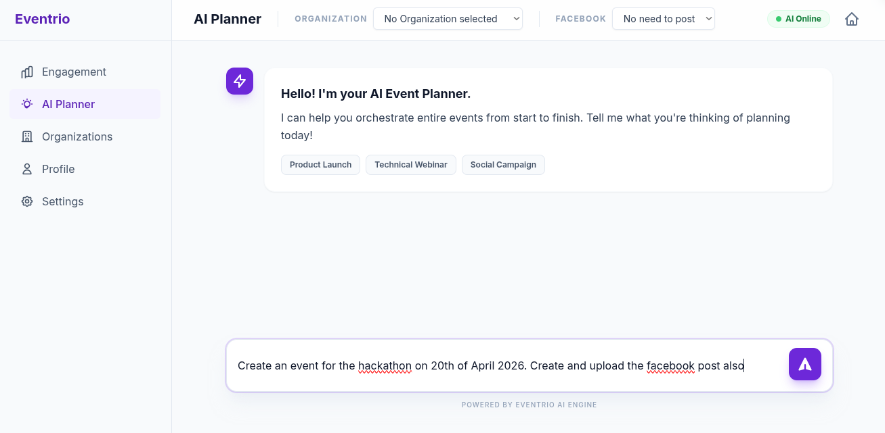
<!-- slide -->
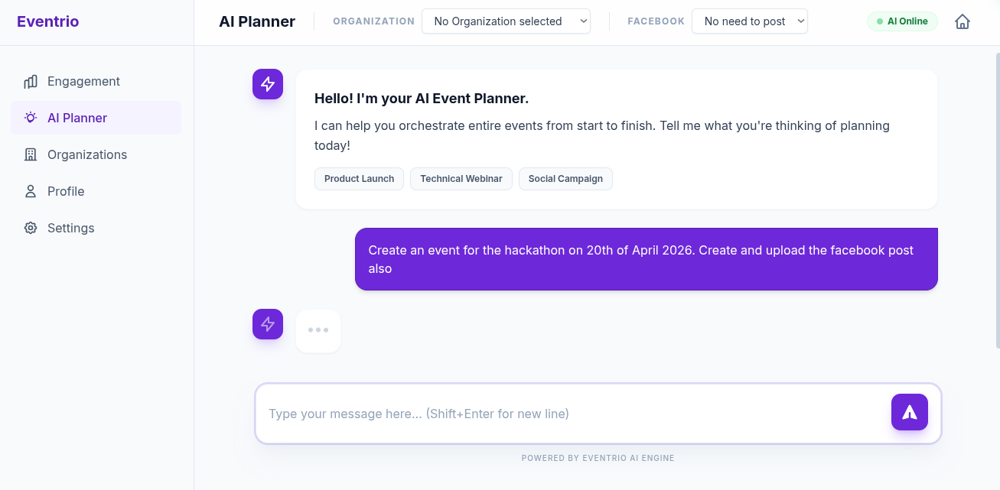
<!-- slide -->
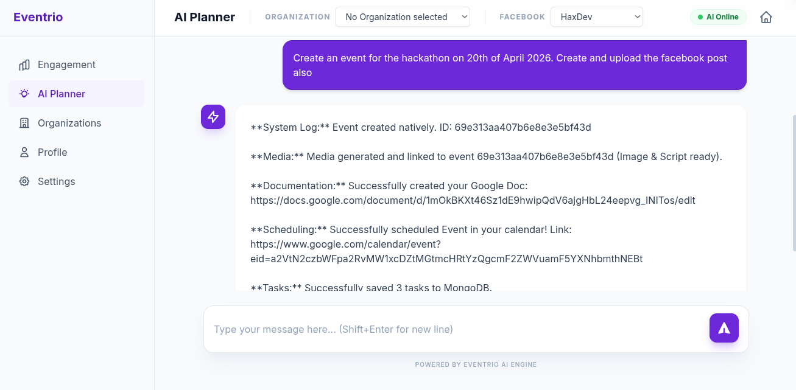
<!-- slide -->

<!-- slide -->
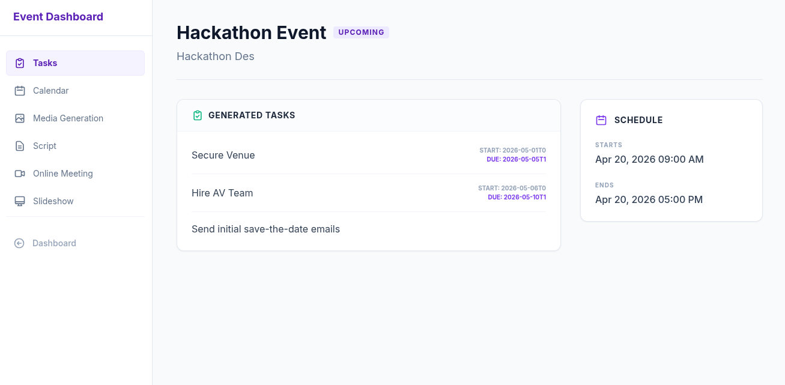
<!-- slide -->
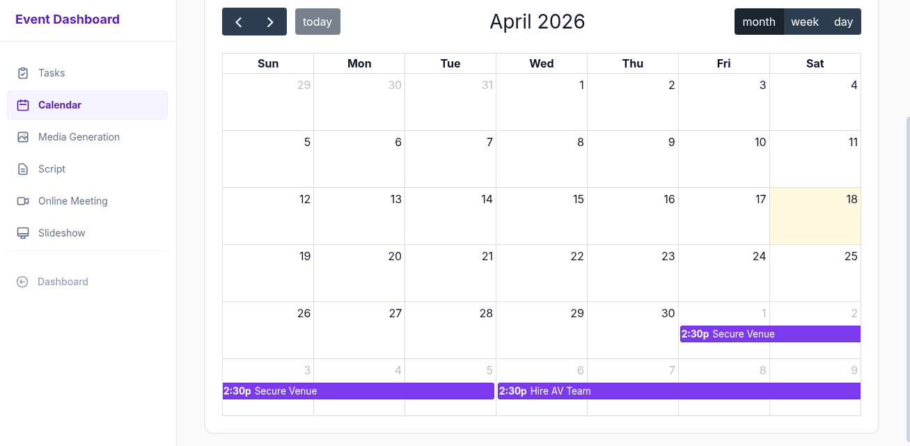
<!-- slide -->
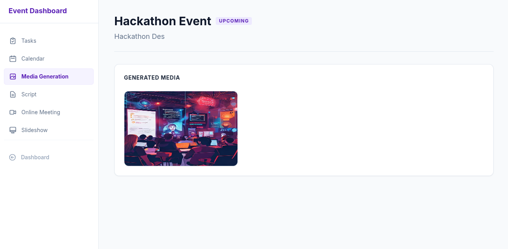
<!-- slide -->
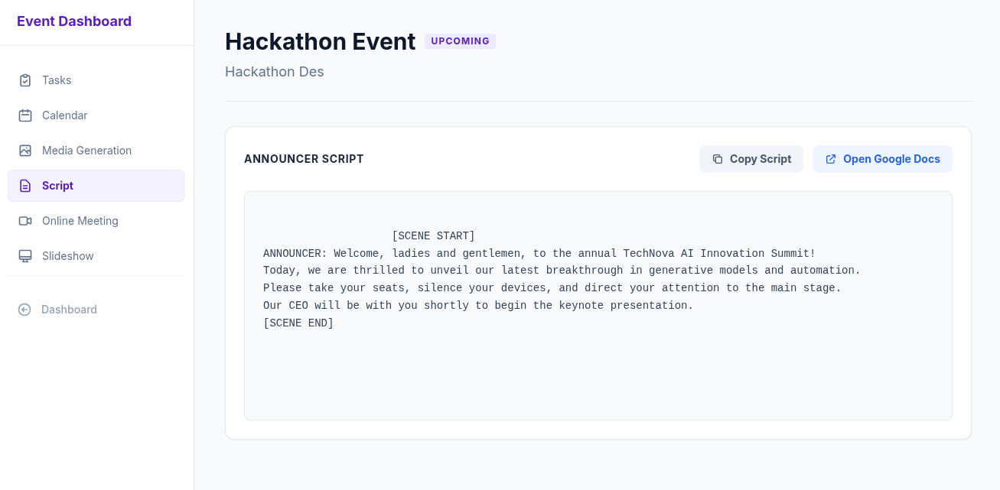
<!-- slide -->
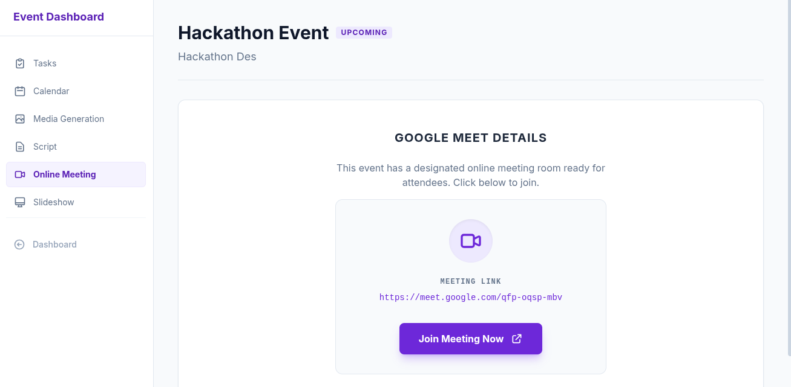
<!-- slide -->
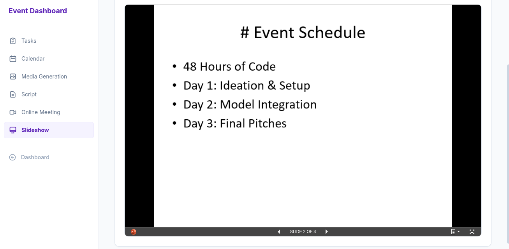


---

## 🛠️ Technical Stack

*   **Backend**: Python, Flask
*   **Database**: MongoDB (MongoEngine)
*   **Cache/Queue**: Redis
*   **AI Engine**: Google GenAI SDK (Gemini)
*   **Payments**: Stripe
*   **Cloud Storage**: Cloudinary
*   **Integrations**: Google Workspace (Docs, Calendar), Facebook Graph API

---

## 🚀 Installation & Setup

### Prerequisites
*   Python 3.8+
*   MongoDB Atlas or local instance
*   Redis server
*   Stripe CLI (for local webhook testing)

### Step-by-Step Installation

1.  **Clone the Repository**
    ```bash
    git clone <repository-url>
    cd eventrio
    ```

2.  **Environment Setup**
    ```bash
    python -m venv venv
    source venv/bin/activate  # Linux/macOS
    # .\venv\Scripts\activate  # Windows
    ```

3.  **Install Dependencies**
    ```bash
    pip install -r requirements.txt
    ```

4.  **Configuration**
    Create a `.env` file in the root directory and add the following keys:
    ```env
    MONGO_URI=your_mongodb_uri
    CLOUDINARY_CLOUD_NAME=your_name
    CLOUDINARY_API_KEY=your_key
    CLOUDINARY_API_SECRET=your_secret
    REDIS_HOST=localhost
    REDIS_PORT=6379
    GOOGLE_OAUTH_CLIENT_ID=your_id
    GOOGLE_OAUTH_CLIENT_SECRET=your_secret
    STRIPE_API_KEY=your_key
    STRIPE_WEBHOOK_SECRET=your_secret
    ```

5.  **Run the Application**
    ```bash
    python run.py
    ```

### Stripe Webhook Setup
To test payments locally:
```bash
stripe login
stripe listen --forward-to localhost:5000/payment/webhook
```

---

## 🗺️ Roadmap

- [ ] **Multi-Platform Posting**: Adding LinkedIn and Pinterest automation.
- [ ] **Advanced Analytics**: Real-time attendee engagement tracking.
- [ ] **Custom AI Personalities**: Tailor the AI agent's tone to your brand.
- [ ] **Mobile App**: Native iOS and Android companions for on-the-go management.

---

## 🤝 Contribution Guidelines

We welcome contributions! To contribute:
1.  **Fork** the repository.
2.  **Create a feature branch** (`git checkout -b feature/AmazingFeature`).
3.  **Commit your changes** (`git commit -m 'Add some AmazingFeature'`).
4.  **Push to the branch** (`git push origin feature/AmazingFeature`).
5.  **Open a Pull Request**.

---

## 📄 License

Distributed under the **MIT License**. See `LICENSE` for more information.

---

*Designed with ❤️ for the GenAI Hackathon.*
