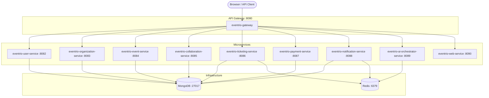

# Eventrio Spring Boot Microservices

Spring Boot conversion of the Eventrio Flask monolith. All HTTP traffic enters through **Spring Cloud Gateway** on port **8080**, which routes requests to dedicated microservices while preserving the original Flask URL structure.

## Prerequisites

| Tool | Version |
|------|---------|
| Java | 17+ |
| Maven | 3.9+ |
| Docker | 24+ (Docker Compose v2) |

Optional API keys (see `.env.example`): Google OAuth, Facebook, Mailjet, Cloudinary, Stripe, Resend, Groq.

## Quick start (Docker Desktop – recommended)

All Spring Boot services run as **Docker containers** (standard `java -jar app.jar`), visible in Docker Desktop alongside Redis.

### 1. Ensure `.env` exists

Credentials are in `eventrio-springboot/.env` (copied from the Python project). MongoDB Atlas URI is used for the database.

### 2. Start everything in Docker

**Windows:**

```powershell
cd eventrio-springboot
.\scripts\docker-up.ps1
```

**Linux / macOS:**

```bash
chmod +x scripts/docker-up.sh
./scripts/docker-up.sh
```

Or manually:

```bash
docker compose up -d --build
```

First build takes ~10–15 minutes (Maven builds inside Docker). After that, Docker Desktop shows **12 containers**:

| Container | Port |
|-----------|------|
| eventrio-gateway | 8080 |
| eventrio-user-service | 8082 |
| eventrio-organization-service | 8083 |
| eventrio-event-service | 8084 |
| eventrio-collaboration-service | 8085 |
| eventrio-ticketing-service | 8086 |
| eventrio-payment-service | 8087 |
| eventrio-notification-service | 8088 |
| eventrio-ai-orchestrator-service | 8089 |
| eventrio-web-service | 8090 |
| eventrio-redis | 6379 |

Open [http://localhost:8080](http://localhost:8080)

```bash
docker compose ps          # status
docker compose logs -f eventrio-gateway
docker compose down        # stop all
```

### Alternative: local Maven mode (not in Docker Desktop)

```powershell
docker compose up -d redis   # Redis only
mvn clean install -DskipTests
.\scripts\start-all.ps1      # runs java processes on your machine
```

---

## Quick start (legacy – infra only)

## Running services individually

Run from the `eventrio-springboot` directory. Start backend services first, then the gateway last.

```bash
# Infrastructure must be running (MongoDB + Redis)
mvn spring-boot:run -pl eventrio-user-service          # 8082
mvn spring-boot:run -pl eventrio-organization-service  # 8083
mvn spring-boot:run -pl eventrio-event-service         # 8084
mvn spring-boot:run -pl eventrio-collaboration-service # 8085
mvn spring-boot:run -pl eventrio-ticketing-service     # 8086
mvn spring-boot:run -pl eventrio-payment-service       # 8087
mvn spring-boot:run -pl eventrio-notification-service  # 8088
mvn spring-boot:run -pl eventrio-ai-orchestrator-service # 8089
mvn spring-boot:run -pl eventrio-web-service           # 8090
mvn spring-boot:run -pl eventrio-gateway               # 8080
```

---

## Architecture



---

## Service port table

| Module | Port | Gateway routes | Responsibility |
|--------|------|----------------|----------------|
| `eventrio-gateway` | **8080** | — | Single entry point; routes all paths |
| `eventrio-user-service` | 8082 | `/api/users/**`, `/connect/**`, `/callbacks/**`, `/main-dashboard/social-status`, `/main-dashboard/get-fb-pages` | Users, Google/Facebook OAuth |
| `eventrio-organization-service` | 8083 | `/main-dashboard/create-org`, `update-org`, `remove-org`, `get-org-projects` | Organizations, Cloudinary uploads |
| `eventrio-event-service` | 8084 | `/main-dashboard/get-list-events`, `/main-dashboard/plan-event/**` | Events, AI plan-event stubs |
| `eventrio-collaboration-service` | 8085 | `/main-dashboard/get-collabs`, `accept-collab`, `/event-ui/**` | Contributors, tasks, Mailjet invites |
| `eventrio-ticketing-service` | 8086 | `/customer/**` | Ticket verification (Resend email) |
| `eventrio-payment-service` | 8087 | `/payment/**` | Stripe checkout & webhooks |
| `eventrio-notification-service` | 8088 | `/stream`, `/notify`, `/notifications/**` | SSE streams, Redis pub/sub |
| `eventrio-ai-orchestrator-service` | 8089 | `/ai/**`, `/testing/**`, `/test-push` | SAGA engine, Groq agents |
| `eventrio-web-service` | 8090 | `/**` (default) | Thymeleaf UI (landing, dashboard, login) |
| `eventrio-common` | — | — | Shared DTOs, enums, utilities |

---

## Gateway routing detail

The gateway mirrors Flask blueprint prefixes exactly:

| Path pattern | Target |
|--------------|--------|
| `/api/users/**` | User service |
| `/connect/**`, `/callbacks/**` | User service (OAuth) |
| `/main-dashboard/create-org`, `update-org/**`, `remove-org/**`, `get-org-projects/**` | Organization service |
| `/main-dashboard/get-list-events`, `plan-event/**` | Event service |
| `/main-dashboard/get-collabs`, `accept-collab` | Collaboration service |
| `/main-dashboard/social-status`, `get-fb-pages` | User service |
| `/event-ui/**` | Collaboration service |
| `/customer/**` | Ticketing service |
| `/payment/**` | Payment service |
| `/stream`, `/notify`, `/notifications/**` | Notification service |
| `/ai/**`, `/testing/**`, `/test-push` | AI orchestrator service |
| `/**` | Web service (UI pages, static assets) |

---

## Feature parity with Flask

| Flask area | Spring module | Status |
|------------|---------------|--------|
| User accounts & profiles | `eventrio-user-service` | Implemented |
| Google / Facebook OAuth | `eventrio-user-service` | Implemented |
| Organization CRUD | `eventrio-organization-service` | Implemented |
| Event listing & plan-event | `eventrio-event-service` | Implemented (AI agents stubbed) |
| Collaborators & tasks | `eventrio-collaboration-service` | Implemented |
| Customer ticket verification | `eventrio-ticketing-service` | Implemented |
| Stripe payments | `eventrio-payment-service` | Implemented |
| SSE notifications | `eventrio-notification-service` | Implemented |
| SAGA / AI orchestration | `eventrio-ai-orchestrator-service` | Stub (Celery workers not ported) |
| Thymeleaf UI pages | `eventrio-web-service` | Templates served; server-side data loading partial |
| APScheduler / background jobs | — | Not ported |
| Celery task workers | — | Not ported (Redis channel stubs only) |

---

## Project structure

```
eventrio-springboot/
├── pom.xml                          # Parent POM (11 modules)
├── docker-compose.yml               # MongoDB + Redis
├── .env.example                     # Environment template
├── scripts/
│   ├── start-all.ps1                # Windows startup
│   └── start-all.sh                 # Unix startup
├── templates-source/                # Thymeleaf HTML (shared with Flask)
├── eventrio-common/
├── eventrio-gateway/
├── eventrio-user-service/
├── eventrio-organization-service/
├── eventrio-event-service/
├── eventrio-collaboration-service/
├── eventrio-ticketing-service/
├── eventrio-payment-service/
├── eventrio-notification-service/
├── eventrio-ai-orchestrator-service/
└── eventrio-web-service/
```

---

## Troubleshooting

- **502 Bad Gateway** — A downstream service is not running. Check logs in `logs/` (created by start scripts).
- **MongoDB connection refused** — Run `docker compose up -d` and verify `MONGO_URI` in `.env`.
- **OAuth redirect mismatch** — Set `FACEBOOK_REDIRECT_URI` to `http://localhost:8082/callbacks/meta` (gateway forwards `/callbacks/**`).
- **Templates not found** — Ensure `EVENTRIO_TEMPLATES_DIR` points to `templates-source` when running the web service from a non-default directory.

---

## License

Part of the Eventrio GenAI Hackathon MVP.
